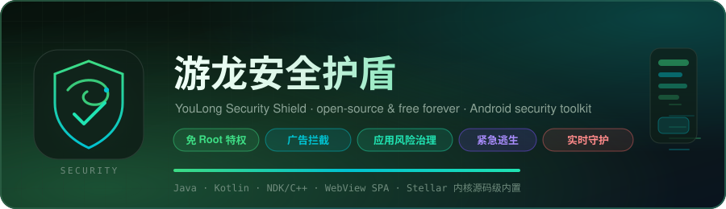

<a id="readme-top"></a>
<div align="center">



<a href="#-这是什么"></a>

# 游龙安全护盾（YouLong Security Shield）

### 🛡️ 免 Root 的 Android 安全防护 / 广告拦截 / 应用风险治理工具

**An open-source &amp; forever-free Android security toolkit — no root required.**

混合架构单包 APK：WebView 单页前端 + 原生 Java/Kotlin + NDK/C++，
**源码级内置**开源特权内核 [Stellar](https://github.com/roro2239/Stellar)（Shizuku 深度定制分支）——
不依赖任何外部 App，即可完成卸载 / 强停 / 冻结等 shell 特权操作。

**项目状态 · 许可**

<a href="#-开发状态重点还没做完"></a>
<a href="#-免责声明"></a>
<a href="https://github.com/iill392/youlong-security/stargazers"></a>
<a href="https://github.com/iill392/youlong-security/forks"></a>
<a href="https://github.com/iill392/youlong-security/issues"></a>
<a href="#-编译"></a>

**构建环境**


**技术栈**

<picture>
  <source media="(prefers-color-scheme: dark)" srcset="https://skillicons.dev/icons?i=java,kotlin,androidstudio,gradle,cpp,cmake,html,git,github&amp;theme=dark"/>
  
</picture>

**快速跳转**

<a href="#-这是什么"></a>
<a href="#-开发状态重点还没做完"></a>
<a href="#-编译"></a>
<a href="#-用到的开源项目必须保留的署名"></a>
<a href="#-免责声明"></a>
<a href="#-许可证"></a>

</div>

---

> ## ⚠️ 重要声明：这是**下个版本研发中、尚未研发完成**的源码快照
>
> 本仓库公开的是 9.1.1 之后**下一代版本**的开发中代码，**不是可用的正式版**：
>
> - 很多功能**还在改、还没做完**（见下方「开发状态」），随时可能编译失败或运行异常；
> - 部分页面/按钮是半成品，部分能力只跑通了一半，**请勿用于生产环境或正式分发**；
> - 接口、数据库结构、配置文件都可能在后续提交里直接改掉，**不保证兼容**；
> - 仓库里的描述只代表当时那次提交的状态，**不代表最终形态**。
>
> 想用稳定版本请等正式发布，不要拿这个仓库的代码直接对外发布。

---

<a id="at-a-glance"></a>
## 🔭 一眼看懂

<table>
<tr>
<td align="center" width="33%">

🛡️

**实时守护**

前台服务常驻<br/>按用户设定持续巡检

</td>
<td align="center" width="33%">

🚨

**紧急逃生**

连按音量键 / 摇晃手机<br/>触发紧急拦截救援（可自定义）

</td>
<td align="center" width="33%">

🎚️

**多档拦截**

基础 / 日常 / 超级 / 极强<br/>命中后可强制停止或卸载

</td>
</tr>
<tr>
<td align="center" width="33%">

🔓

**免 Root 特权**

源码级内置 Stellar 内核<br/>以 shell(uid 2000) 执行特权操作

</td>
<td align="center" width="33%">

👁️

**无障碍拦截**

基于 AccessibilityService<br/>自动跳过广告、风险提示

</td>
<td align="center" width="33%">

📋

**日志与自检**

崩溃与运行轨迹落文件<br/>页面一键复制日志回传

</td>
</tr>
</table>

<p align="right"><a href="#readme-top" title="返回顶部">⬆️ 返回顶部</a></p>

---

## 📖 目录

<table>
<tr>
<td valign="top" width="50%">

**项目**
- [🔭 一眼看懂](#at-a-glance)
- [一、这是什么](#-这是什么)
- [二、开发状态（重点：还没做完）](#-开发状态重点还没做完)
- [三、编译](#-编译)
- [四、用到的开源项目（必须保留的署名）](#-用到的开源项目必须保留的署名)

</td>
<td valign="top" width="50%">

**合规与文档**
- [五、免责声明](#-免责声明)
- [六、许可证](#-许可证)
- [七、开发记录索引（docs/）](#-开发记录索引docs)
- [📊 Star History](#-star-history)
- [🤝 贡献](#-贡献)

</td>
</tr>
</table>

---

<a id="-这是什么"></a>
## 一、这是什么

**游龙安全护盾**是一个 Android 端的**安全防护 / 广告拦截 / 应用风险治理**工具，核心能力：

| 能力 | 说明 |
|---|---|
| 实时守护 | 前台服务常驻，按用户设定持续巡检 |
| 紧急逃生 | 连按音量键 / 摇晃手机，触发紧急拦截救援（可自定义按键与次数） |
| 拦截模式 | 基础 / 日常 / 超级 / 极强 多档拦截强度，命中后可强制停止或卸载 |
| 无障碍拦截 | 基于 `AccessibilityService` 做自动跳过、风险提示 |
| 特权操作 | **免 root**，以系统 `shell`(uid 2000) 身份执行卸载 / 强停 / 冻结等操作 |
| 应用列表与风险 | 读取已安装应用、按高危权限/风险分类展示（自研界面） |
| 日志与自检 | 崩溃与运行轨迹落文件，页面一键复制日志回传 |

技术上它是一个**混合架构**：

```
┌─────────────────────────── APK（单包，applicationId: com.youlong.hd）───────────────────────────┐
│                                                                                                │
│  WebView 前端（assets/index.html，单页应用，JS 桥接原生）                                        │
│        ↕  @JavascriptInterface                                                                 │
│  原生 Java 层（Activity / Service / 无障碍 / 覆盖层 / 权限与守护逻辑）                            │
│        ↕                                                                                       │
│  特权内核（源码级内置的 Stellar：manager / server / api / provider / aidl / native）             │
│        ↕ Binder                                                                                │
│  stellar_server（以 uid 2000 shell 运行的独立进程，由 app_process 拉起）                          │
└────────────────────────────────────────────────────────────────────────────────────────────────┘
```

- **免 root 特权**：不是自己造轮子，而是**源码级内置**开源项目 [Stellar](https://github.com/roro2239/Stellar)
  （Shizuku 的深度定制分支），把服务端、客户端 API、AIDL 一并编进本 APK，
  因此**不依赖任何外部 App**（不需要装 Shizuku，也不需要装 Stellar 管理器）。
- **自研界面**：Stellar 只作为内核使用；用户可见的界面（特权面板、授权页、应用列表、
  设置页）已全部改为本项目自研，不复用上游界面。
- **前端可热改**：主界面是 WebView 里的单页应用，改 `assets/index.html` 即可调整 UI。

<p align="right"><a href="#readme-top" title="返回顶部">⬆️ 返回顶部</a></p>

---

<a id="-开发状态重点还没做完"></a>
## 二、开发状态（重点：还没做完）

### ✅ 已完成 / 基本可用

- [x] 实时守护服务、哨兵进程互拉、前台服务与通知
- [x] 紧急逃生：音量键连按（按键/次数可自定义）与摇一摇（力度档位可自定义）
      —— 已修复“触发一次后就再也触发不了”的问题，真机连续触发验证通过
- [x] 无障碍丢失 / 悬浮窗丢失时的自动降级与恢复
- [x] 无障碍劫持防护 + 音量键事件接管
- [x] 多档拦截模式与覆盖层弹窗
- [x] 免 root 特权内核（Stellar 源码级内置）：卸载 / 强停 / 冻结 / 执行 shell 命令
- [x] 自研特权服务面板（状态 / 身份 / 授权 / 重连 / 自检 / 应用列表 / 设置）
- [x] 自研应用列表页（RecyclerView + DiffUtil + 异步图标，滚动无明显掉帧）
- [x] 崩溃与运行轨迹落文件 + 页面一键复制日志

### 🚧 未完成 / 已知问题

- [ ] **ADB 无线调试配对**（SPAKE2 + TLS exporter，AOSP 公开协议）**尚未实现**
      —— 目前免 root 特权只能走“由本应用自己拉起服务端”这一条路
- [ ] 病毒库 / 自动拦截：**本仓库不包含**（见下节），相关检测逻辑保留但为空实现
- [ ] 部分界面文案与交互仍在调整，个别入口是半成品
- [ ] 代码里保留了历史迭代的注释与开关，尚未做统一清理

### 🗑️ 明确移除（不随本仓库发布）

| 移除项 | 说明 |
|---|---|
| **自动拦截病毒库** | 病毒库数据、服务器域名、5 个列表路径、关键字库**一律不发布**；`VirusDb` 不再发起任何网络请求，`get()` 返回空库 —— 开源版**不会自动卸载任何应用**，也不会误报。接入自有数据源的方法见 `VirusDb` 类注释（TODO）。 |
| **应用签名** | 发布 keystore、别名、口令、内置的官方签名证书指纹、盗版警告页，以及“签名绑定资源加密”用的种子/盐**全部移除**；`release` 只产出未签名 APK，前端资源以明文分发，**任何人重新签名都能正常跑**（方便二次开发）。 |

> 也就是说：这个仓库是**能力完整、数据留白**的版本。
> 想把它变成能用的产品，需要自己接病毒库、自己签名。

<p align="right"><a href="#readme-top" title="返回顶部">⬆️ 返回顶部</a></p>

---

<a id="-编译"></a>
## 三、编译

### 环境要求

| 项 | 版本 |
|---|---|
| JDK | 21（实测 Temurin 21） |
| Gradle | 8.14（仓库自带 wrapper，无需另装） |
| Android Gradle Plugin | 8.13.2 |
| Kotlin | 2.2.0 |
| Android SDK | `compileSdk 37` / `targetSdk 37` / `minSdk 24` |
| NDK | `29.0.13113456`（含 CMake 3.22.1 + prefab） |

> ⚠️ **工程路径必须是纯 ASCII**（例如 `E:\anquan`）。
> 路径里带中文会让 `aidl.exe` 写出的依赖文件按 GBK 落盘，而 AGP 在 JDK 18+ 上固定按 UTF-8 读回，
> 直接 `MalformedInputException`。这不是 Gradle 参数能绕过的，只能改路径。
> 详见 `docs/游龙安全护盾-编译指南.md` 与 `gradle.properties` 里的说明。

### 命令

```bash
# 调试包（用 Android 默认调试密钥签名，可直接安装）
./gradlew assembleDebug

# 发布包（未签名，产物 app/build/outputs/apk/release/app-release-unsigned.apk）
./gradlew assembleRelease

# 自己签名
apksigner sign --ks 你的.jks --out app-signed.apk \
  app/build/outputs/apk/release/app-release-unsigned.apk
```

首次构建需要联网拉依赖（AndroidX / Compose / JitPack 上的 libsu、Capsule、compose-markdown）。

### 目录结构

```
.
├── app/                         宿主应用（Java + Kotlin + WebView 前端 + Native）
│   ├── src/main/assets/index.html      前端界面（单页应用，明文，可直接改）
│   ├── src/main/java/com/youlong/hd/   原生逻辑（守护服务、无障碍、覆盖层、特权面板…）
│   ├── src/main/kotlin/                部分 Compose / 工具代码
│   ├── src/main/cpp/                   Native：加密核心、哨兵、Stellar 启动器
│   └── build.gradle                    签名（已移除）、R8、prefab 解压
├── embedded/                    源码级内置的开源内核（Stellar / 其内含的 Shizuku 部分）
│   ├── manager/                 管理器模块（本仓库中仅作为内核依赖，界面已改为自研）
│   ├── server/                  特权服务端（以 shell 身份运行）
│   ├── api/ provider/ aidl/ shared/ userservice/ shizuku-aidl/ shizuku-api/
│   └── LICENSES/                Apache-2.0 / Stellar-MPL-2.0
├── hardening/                   R8 混淆字典（类名/成员名）
├── LICENSES/                   第三方代码的许可证全文（Apache-2.0、MPL-2.0）
├── docs/                        开发记录与编译指南（含真机验证记录）
├── NOTICE                       第三方组件与对上游的修改声明（MPL-2.0 §3.4 / Apache-2.0 §4(b)）
├── THIRD_PARTY_NOTICES.md       全部第三方组件及其许可证清单
└── LICENSE                      本仓库许可：GNU AGPL-3.0（自有代码）
```

<p align="right"><a href="#readme-top" title="返回顶部">⬆️ 返回顶部</a></p>

---

<a id="-用到的开源项目必须保留的署名"></a>
## 四、用到的开源项目（必须保留的署名）

本项目**站在一堆开源项目的肩膀上**，下面按“融合方式”分类列出。
完整到组件版本级别的清单见 **[`THIRD_PARTY_NOTICES.md`](THIRD_PARTY_NOTICES.md)**，
对上游的逐文件修改清单见 **[`NOTICE`](NOTICE)**，许可证全文见 **[`LICENSES/`](LICENSES)**。

### 4.1 源码级内置（`embedded/` 与 `app/src/main/cpp/stellar/`）

| 项目 | 许可证 | 说明 |
|---|---|---|
| **[Stellar](https://github.com/roro2239/Stellar)**（含 [Stellar-API](https://github.com/roro2239/Stellar-API)） | **MPL-2.0**（修改部分） | 免 root 特权内核。本项目的 `embedded/*`、`app/src/main/cpp/stellar/*` 即其（已修改的）源码，随仓库分发以履行 MPL-2.0 的源码提供义务。**注意：MPL-2.0 是文件级弱 copyleft，只约束被覆盖的那些文件，不要求本项目整体开源。** |
| **Shizuku**（经 Stellar 内含） | Apache-2.0 | 版权归 [RikkaApps](https://github.com/RikkaApps/Shizuku)。Stellar 内部保留了 Shizuku 兼容层与 AIDL，本项目随 Stellar 一并分发。 |
| **AOSP adb / ADB 配对协议** | Apache-2.0 | 版权归 The Android Open Source Project。`app/src/main/cpp/stellar/adb_pairing.cpp` 参考其公开协议实现思路。 |
| **kyant backdrop**（毛玻璃效果） | Apache-2.0 | 版权归 Kyant，位于 `app/src/main/kotlin/com/kyant/backdrop/`。 |

> 上游代码的版权头与许可证声明**一律原样保留**；本项目对它们的每一处修改都在文件内
> 以显著注释标注，并汇总在 `NOTICE` 中。

### 4.2 依赖库（Gradle / Maven）

| 项目 | 许可证 | 用途 |
|---|---|---|
| [AndroidX](https://developer.android.com/jetpack/androidx)（appcompat / core / annotation / constraintlayout / multidex / browser / fragment / recyclerview / lifecycle / preference / activity / navigation / **Compose** / **Room** / **WorkManager** / splashscreen …） | Apache-2.0 | 基础框架、UI、数据库、后台任务 |
| [Material Components for Android](https://github.com/material-components/material-components-android) | Apache-2.0 | 界面控件与主题 |
| [Kotlin](https://kotlinlang.org/) / [kotlinx.coroutines](https://github.com/Kotlin/kotlinx.coroutines) | Apache-2.0 | 语言运行时与协程 |
| [Gson](https://github.com/google/gson) | Apache-2.0 | JSON |
| [Conscrypt](https://github.com/google/conscrypt) | Apache-2.0 | TLS 提供者（含本仓库内随附的 stub，见 `app/libs/`） |
| [OkHttp](https://square.github.io/okhttp/) / Okio | Apache-2.0 | 网络请求 |
| [libsu](https://github.com/topjohnwu/libsu) | Apache-2.0 | shell 调用（Stellar 管理器模块用） |
| [HiddenApiBypass](https://github.com/LSPosed/AndroidHiddenApiBypass) | Apache-2.0 | 隐藏 API 豁免 |
| [libcxx (LSPosed 预编译)](https://github.com/LSPosed/libcxx) | Apache-2.0（LLVM 例外条款） | NDK libc++（prefab） |
| [boringssl (vvb2060 ndk)](https://github.com/vvb2060/boringssl) | OpenSSL License + ISC + BSD 系 | 密码学静态库（prefab），ADB 配对用 |
| [RikkaX](https://github.com/RikkaApps/RikkaX)（rikkax.* / parcelablelist / appiconloader） | Apache-2.0 | 上游管理器模块的 UI 依赖 |
| [HiddenApi (rikka)](https://github.com/RikkaW/HiddenApi)（`dev.rikka.hidden:compat` / `stub`） | MIT | 隐藏 API 反射桥 |
| [HiddenApiRefinePlugin](https://github.com/RikkaApps/HiddenApiRefinePlugin)（refine runtime / 插件） | MIT | 编译期隐藏 API 替身类改写 |
| [Capsule](https://github.com/Kyant0/Capsule) | Apache-2.0 | 毛玻璃/背景模糊（JitPack） |
| [compose-markdown](https://github.com/jeziellago/compose-markdown) | Apache-2.0 | Markdown 渲染（JitPack） |
| [Bouncy Castle](https://www.bouncycastle.org/)（bcpkix-jdk18on） | Bouncy Castle Licence（MIT 系） | 证书与密钥处理 |

### 4.3 仅正式发布版使用（本仓库**未包含**）

| 项目 | 许可证 | 说明 |
|---|---|---|
| [javascript-obfuscator](https://github.com/javascript-obfuscator/javascript-obfuscator) | BSD-2-Clause | 正式版构建时对前端内联 JS 做混淆；本开源包已移除该构建步骤，因此不需要 Node.js，也不再分发其产物。 |

<p align="right"><a href="#readme-top" title="返回顶部">⬆️ 返回顶部</a></p>

---

<a id="-免责声明"></a>
## 五、免责声明

- 本仓库是**开发中快照**，按“现状”提供，**不提供任何形式的担保**，作者不对使用后果负责。
- 项目涉及**无障碍服务**与**免 root 特权（shell 身份）**能力，权限很高：
  请只在**你自己的设备**上、在**了解其行为**的前提下使用。
- 请遵守你所在地区的法律法规与各应用商店的政策。**不要用它做任何违法用途。**
- 第三方组件归各自版权人所有，使用时请同时遵守它们的许可证（见 `THIRD_PARTY_NOTICES.md`）。

<p align="right"><a href="#readme-top" title="返回顶部">⬆️ 返回顶部</a></p>

---

<a id="-许可证"></a>
## 六、许可证

**本仓库（含本项目自有代码）以 [GNU Affero General Public License v3.0](LICENSE) 发布。**

| 范围 | 许可证 |
|---|---|
| 本项目**自有代码**（`app/` 下的 Java/Kotlin/前端/Native、文档等） | **AGPL-3.0**（见根目录 [`LICENSE`](LICENSE)） |
| `embedded/` 与 `app/src/main/cpp/stellar/` 中**来自 Stellar 的（已修改）文件** | **Mozilla Public License 2.0**（见 [`LICENSES/MPL-2.0.txt`](LICENSES/MPL-2.0.txt)）；**文件级 copyleft，仅覆盖这些文件本身** |
| 经 Stellar 内含的 **Shizuku** 代码、AOSP adb 协议实现、kyant backdrop | **Apache-2.0**（版权归各自作者） |
| 其余第三方依赖（AndroidX / Compose / Room / BoringSSL / libc++ …） | 见 [`THIRD_PARTY_NOTICES.md`](THIRD_PARTY_NOTICES.md) |

> **兼容性说明**：AGPL-3.0 与上表中的第三方许可可以并存 ——
> MPL-2.0 第 3.3 条的 Secondary License 明确包含 AGPL-3.0；
> Apache-2.0 与 AGPL-3.0（GPL-3.0 + 网络条款）兼容。
> 第三方文件的版权头与许可证声明一律原样保留，未作删改。
>
> ⚠️ **历史说明**：本项目自有代码过去按 Apache-2.0 发布（旧注释/旧文档里可能仍写着
> Apache-2.0），自本次开源起统一改为 **AGPL-3.0**；`NOTICE`、`THIRD_PARTY_NOTICES.md`
> 与应用内「开源许可」页面（`res/raw/open_source_licenses.txt`）已同步更新。

<p align="right"><a href="#readme-top" title="返回顶部">⬆️ 返回顶部</a></p>

---

<a id="-开发记录索引docs"></a>
## 七、开发记录索引（`docs/`）

| 文档 | 内容 |
|---|---|
| [游龙安全护盾-编译指南.md](docs/游龙安全护盾-编译指南.md) | 环境、构建、常见构建报错、路径与 AIDL 的坑 |
| [MIGRATION_STELLAR.md](docs/MIGRATION_STELLAR.md) | 内核从 Shizuku 迁移到 Stellar 的完整记录 |
| [自研特权界面_阶段进展.md](docs/自研特权界面_阶段进展.md) | 界面自研（替换上游界面）的进展与设计 |
| [自研特权内核_真机验证记录.md](docs/自研特权内核_真机验证记录.md) | 自研内核路线的真机验证与结论（技术储备） |
| [逃生只能触发一次_修复记录.md](docs/逃生只能触发一次_修复记录.md) | 紧急逃生“只能触发一次”的根因与真机验证 |
| [卡顿与闪退_修复记录.md](docs/卡顿与闪退_修复记录.md) | 卡顿/闪退的定位方法与修复（含真机掉帧数据） |
| [外部授权漏洞加固记录.md](docs/外部授权漏洞加固记录.md) | 授权入口的安全加固 |
| [白屏修复记录.md](docs/白屏修复记录.md) / [打开即请求权限_实现与实测.md](docs/打开即请求权限_实现与实测.md) / [读取应用列表弹窗_已实现并验证.md](docs/读取应用列表弹窗_已实现并验证.md) / [读取应用列表权限_改回与增强.md](docs/读取应用列表权限_改回与增强.md) | 各功能点的实现与实测记录 |
| [LICENSE_COMPLIANCE_AUDIT.md](docs/LICENSE_COMPLIANCE_AUDIT.md) | 开源许可证合规自查 |
| `ROUND*_改动汇总.md` | 各轮迭代的改动汇总 |

<p align="right"><a href="#readme-top" title="返回顶部">⬆️ 返回顶部</a></p>

---

<a id="-star-history"></a>
## 📊 Star History

<picture>
  <source media="(prefers-color-scheme: dark)" srcset="https://api.star-history.com/svg?repos=iill392/youlong-security&amp;type=Date&amp;theme=dark"/>
  <source media="(prefers-color-scheme: light)" srcset="https://api.star-history.com/svg?repos=iill392/youlong-security&amp;type=Date"/>
  
</picture>

<p align="right"><a href="#readme-top" title="返回顶部">⬆️ 返回顶部</a></p>

---

<a id="-贡献"></a>
## 🤝 贡献

欢迎 Issue 与 PR！提交前请阅读：

- 编译前确认环境（见[三、编译](#-编译)），**工程路径必须为纯 ASCII**；
- 涉及上游 `embedded/` 的改动请保持版权头与许可证声明原样（见 [NOTICE](NOTICE)）；
- 新增第三方依赖请同步更新 [`THIRD_PARTY_NOTICES.md`](THIRD_PARTY_NOTICES.md)；
- 遵守 [AGPL-3.0](LICENSE) 与各第三方许可证。

<p align="right"><a href="#readme-top" title="返回顶部">⬆️ 返回顶部</a></p>

---

<div align="center">

**🛡️ 游龙安全护盾 · 开源 · 永久免费**

<sub>用 [Stellar](https://github.com/roro2239/Stellar) 等开源项目构建 · 以 AGPL-3.0 发布 · Made with ❤️</sub>

</div>
